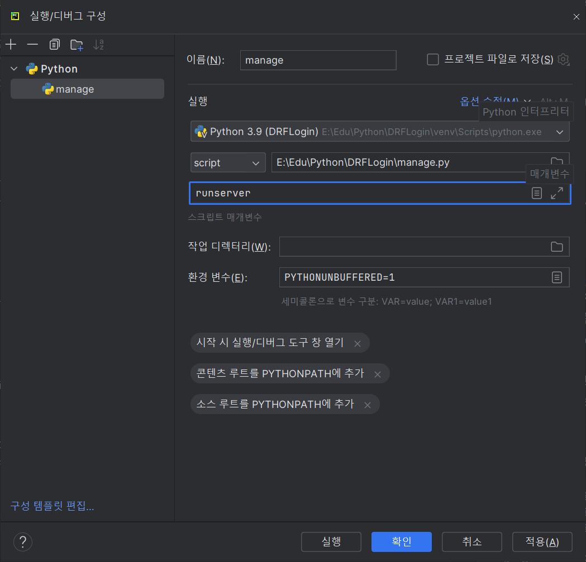
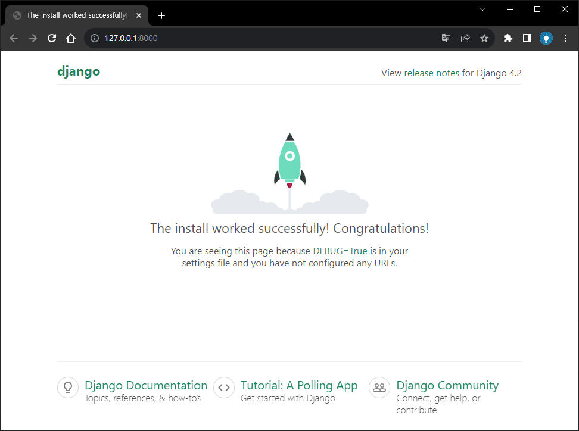
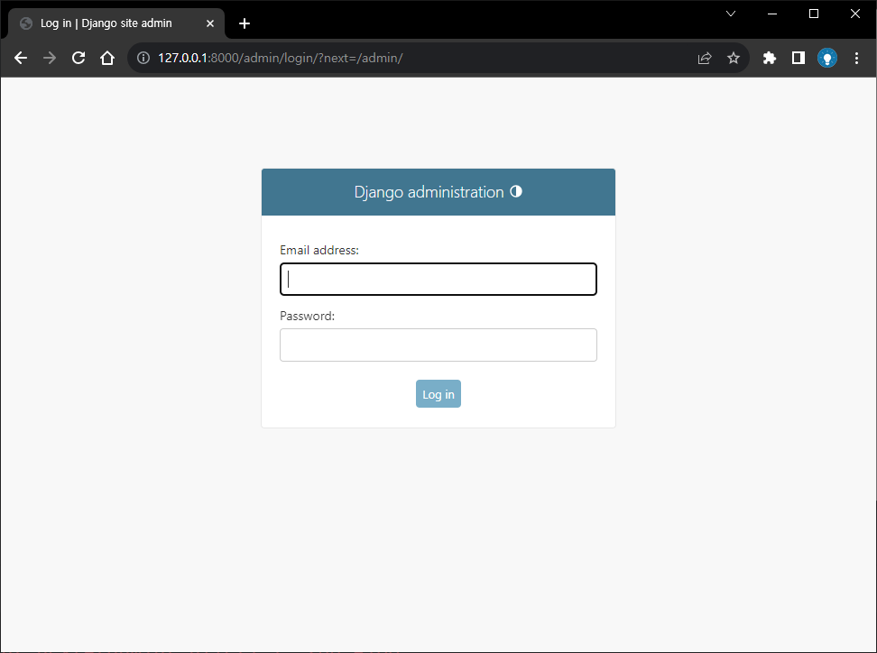

# Django-Rest-Framework(DRF) Login

### 1. 파이참 프로젝트 생성
- 프로젝트명 : DRFLogin
- 인터프리터 : DRFLogin\venv

### 2. pip와 setuptool 업그레이드
```
python -m pip install --upgrade pip
pip install --upgrade setuptools
pip install --upgrade wheel
```

### 3. Django 설치
```
pip install django
```

### 4. django-admin 새 프로젝트를 시작
```
django-admin startproject config .
```

### 5. Custom User 생성 (email 로 로그인)
- users app 생성
```
python manage.py startapp users
```
- setting.py에 users 추가
```python
INSTALLED_APPS = [
    'django.contrib.admin',
    'django.contrib.auth',
    'django.contrib.contenttypes',
    'django.contrib.sessions',
    'django.contrib.messages',
    'django.contrib.staticfiles',

    # 생성한 App
    'users',
]
```

### 6. UserManager 생성
- users/managers.py 파일 생성
- 사용자 이름 대신 이메일을 고유 식별자로 설정
```python
from django.contrib.auth.base_user import BaseUserManager
from django.utils.translation import gettext_lazy as _


class UserManager(BaseUserManager):
    def create_user(self, email, password, **extra_fields):
        if not email:
            raise ValueError(_('The Email must be set'))
        email = self.normalize_email(email)
        user = self.model(email=email, **extra_fields)
        user.set_password(password)
        user.save()
        return user

    def create_superuser(self, email, password, **extra_fields):
        extra_fields.setdefault('is_staff', True)
        extra_fields.setdefault('is_superuser', True)
        extra_fields.setdefault('is_active', True)

        if extra_fields.get('is_staff') is not True:
            raise ValueError(_('Superuser must have is_staff=True.'))
        if extra_fields.get('is_superuser') is not True:
            raise ValueError(_('Superuser must have is_superuser=True.'))
        return self.create_user(email, password, **extra_fields)

```

### 7. Custom User 생성
- users/models.py 에 User Class 추가
```python
from django.contrib.auth.models import AbstractUser
from django.db import models
from django.utils.translation import gettext_lazy as _

from users.managers import UserManager


class User(AbstractUser):
    username = None
    email = models.EmailField(_('email address'), unique=True)

    USERNAME_FIELD = 'email'
    REQUIRED_FIELDS = []

    objects = UserManager()

    def __str__(self):
        return self.email
```

### 8. AUTH_USER_MODEL 추가
- settings.py 에 SITE_ID, AUTH_USER_MODEL 추가
- setting.py 파일 하단에 추가
```python
AUTH_USER_MODEL = 'users.User' 
```


### 9. 환경변수 숨기기
-  root 디렉토리 /__secret.py 파일 생성 
```python
SECRET_KEY = 'config/settings.py - SECRET_KEY'
DATABASES = {
    'default': {
        'ENGINE': 'django.db.backends.mysql',
        'NAME': 'mysql',
        'USER': 'root',
        'PASSWORD': 'password',
        'HOST': 'localhost',
        'PORT': '3306'
    }
}

KAKAO_REST_API_KEY = 'kakao_key'

SOCIAL_AUTH_GITHUB_CLIENT_ID = 'github_client_id'
SOCIAL_AUTH_GITHUB_SECRET = 'secret'

SOCIAL_AUTH_GOOGLE_CLIENT_ID = 'google_client_id'
SOCIAL_AUTH_GOOGLE_SECRET = 'google_secret_key'

STATE = 'random_string'

```
- settings.py
```python
import __secret

SECRET_KEY = __secret.SECRET_KEY

DATABASES = __secret.DATABASES
```
- .gitignore 파일 생성  secret.py 추가
- /.gitignore 파일 생성  secret.py 추가

```gitignore
# SECRET_KEY
__secret.py
```

### 10. Terminal 에서 migrate 수행
```
python manage.py makemigrations
python manage.py migrate
```

### 11. Terminal 에서 superuser 생성
```
python manage.py createsuperuser
```

### 12. 파이참 실행 구성 편집
- 상단메뉴 > 실행 > 구성 편집
- '+' 버튼 > Python 추가
- 이름 : manage
- script : 프로젝트 경로\DRFLogin\manage.py
- 매개변수 : runserver
####



### 13. 서버 실행 및 Django admin 확인
- 상단 메뉴 > 실행 > 'manage' 실행 (Shift + F10) 또는 명령 실행
```
python manage.py runserver
```
###
- 서버 실행 화면 

<br><br>
- admin 로그인 화면 -  Email address, Password 만 입력 받는 화면



### 14. Rest-Framework, Allauth 설치
```
pip install djangorestframework
pip install djangorestframework-simplejwt

# django-rest-auth 지원 중단 dj-rest-auth 사용
pip install dj-rest-auth
pip install django-allauth

# MySQL 사용시
pip install mysqlclient 
```

### 15. users 설치 라이브러리 추가
- setting.py에 설치 라이브러리 추가
```python
INSTALLED_APPS = [
    'django.contrib.admin',
    'django.contrib.auth',
    'django.contrib.contenttypes',
    'django.contrib.sessions',
    'django.contrib.messages',
    'django.contrib.staticfiles',

    # 생성한 App
    'users',
    
    # site 설정
    'django.contrib.sites',

    # 설치한 라이브러리
    # django-rest-framework
    'rest_framework',
    'rest_framework.authtoken',

    # django-allauth
    'allauth',
    'allauth.account',
    'allauth.socialaccount',

    # dj-rest-auth
    'dj_rest_auth',
    'dj_rest_auth.registration',
]

MIDDLEWARE = [
    'django.middleware.security.SecurityMiddleware',
    'django.contrib.sessions.middleware.SessionMiddleware',
    'django.middleware.common.CommonMiddleware',
    'django.middleware.csrf.CsrfViewMiddleware',
    'django.contrib.auth.middleware.AuthenticationMiddleware',
    'django.contrib.messages.middleware.MessageMiddleware',
    'django.middleware.clickjacking.XFrameOptionsMiddleware',
    
    # 새로 추가한 미들웨어
    'allauth.account.middleware.AccountMiddleware',
]

```


### 16. SITE_ID, USER 필드 설정 추가
- settings.py 에 SITE_ID, USER 필드 설정 추가
- setting.py 파일 하단에 추가
```python
SITE_ID = 1

REST_USE_JWT = True
JWT_AUTH_COOKIE = 'my-app-auth'
JWT_AUTH_REFRESH_COOKIE = 'my-refresh-token'

ACCOUNT_UNIQUE_EMAIL = True
ACCOUNT_USER_MODEL_USERNAME_FIELD = None
ACCOUNT_USERNAME_REQUIRED = False
ACCOUNT_EMAIL_REQUIRED = True
ACCOUNT_AUTHENTICATION_METHOD = 'email'
ACCOUNT_EMAIL_VERIFICATION = 'none'
```
- 변수 설정 설명
```python
# dj-rest-auth
# REST_USE_JWT: JWT 사용 여부
# JWT_AUTH_COOKIE: 호출할 Cookie Key 값
# JWT_AUTH_REFRESH_COOKIE: Refresh Token Cookie Key 값 (사용하는 경우)

# django-allauth
# SITE_ID: 해당 도메인의 id (django_site 테이블의 id, oauth 글에서 다룰 예정)
# ACCOUNT_UNIQUE_EMAIL: User email unique 사용 여부
# ACCOUNT_USER_MODEL_USERNAME_FIELD: User username type
# ACCOUNT_USERNAME_REQUIRED: User username 필수 여부
# ACCOUNT_EMAIL_REQUIRED: User email 필수 여부
# ACCOUNT_AUTHENTICATION_METHOD: 로그인 인증 수단
# ACCOUNT_EMAIL_VERIFICATION: Email 인증 필수 여부
```

### 17. Terminal 에서 새로 추가한 라이브러리 대해 Migration 수행
```
python manage.py migrate
```


### 18. users/urls.py 생성
- users/urls.py 파일을 생성하고 url 추가
```python
from django.urls import path, include

urlpatterns = [
    path('', include('dj_rest_auth.urls')),
    path('registration/', include('dj_rest_auth.registration.urls')),
]

```

### 19. config/urls.py url 추가
- config/urls.py 파일에 url 추가
```python
from django.contrib import admin
from django.urls import path, include

urlpatterns = [
    path('admin/', admin.site.urls),
    path('users/', include('users.urls')),
]

```

### 20. Rest Login 테스트 Urls
- http://127.0.0.1:8000/users/password/reset/ 
- http://127.0.0.1:8000/users/login/
- http://127.0.0.1:8000/users/password/reset/confirm/
- http://127.0.0.1:8000/users/logout/ 
- http://127.0.0.1:8000/users/user/ 
- http://127.0.0.1:8000/users/password/change/ 
- http://127.0.0.1:8000/users/registration/